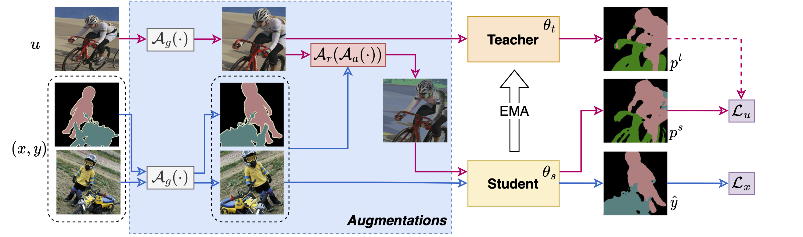

# AugSeg

> "Augmentation Matters: A Simple-yet-Effective Approach to Semi-supervised Semantic Segmentation".


### Introduction


- Recent studies on semi-supervised semantic segmentation (SSS) have seen fast progress. Despite their promising performance, current state-of-the-art methods tend to increasingly complex designs at the cost of introducing more network components and additional training procedures. 

- Differently, in this work, we follow a standard teacher-student framework and propose AugSeg, a simple and clean approach that focuses mainly on data perturbations to boost the SSS performance. We argue that various data augmentations should be adjusted to better adapt to the semi-supervised scenarios instead of directly applying these techniques from supervised learning. Specifically, we adopt a simplified intensity-based augmentation that selects a random number of data transformations with uniformly sampling distortion strengths from a continuous space. Based on the estimated confidence of the model on different unlabeled samples, we also randomly inject labelled information to augment the unlabeled samples in an adaptive manner. 

- Without bells and whistles, our simple AugSeg can readily achieve new state-of-the-art performance on SSS benchmarks under different partition protocols.


### Diagram



> Without any  complicated designs, AugSeg readily obtains new SOTA performance on popular SSS benchmarks under different partition protocols. We hope our AugSeg can inspir future studies, and serve as a strong baseline for SSS.


### Performance

Labeled images are sampled from the **original high-quality** training set. Results are obtained by DeepLabv3+ based on ResNet-101 with training size 512.

| Method                      | 1/115 (92)| 1/57 (183)| 1/28 (366)| 1/14 (732)| 1/7 (1464)  |
| :-------------------------: | :-------: | :-------: | :-------: | :-------: | :---------: |
| SupOnly                     | 43.92 | 59.10| 65.88 | 70.87 | 74.97 |
| ST++                        | 65.2      | 71.0      | 74.6      | 77.3      | 79.1        |
| PS-MT                       | 65.80      | 69.58      | 76.57      | 78.42      | 80.01        |
| U<sup>2</sup>PL             | 67.98      | 69.15      | 73.66      | 76.16      | 79.49        |
| **AugSeg**         | **71.09** | **75.45**  | **78.80**  | **80.33**  | **81.36**    |


Results are obtained by DeepLabv3+ based on ResNet-50/101. We reproduce U<sup>2</sup>PL results on ResNet-50.

| R50                      | 1/16   | 1/8     | 1/4       | 1/2 | R101 | 1/16        | 1/8       | 1/4 | 1/2 |
| :-------------------------: | :-------: | :-------: | :-------: | :-------: | :---------: | :---------: | :---------: | --------------------------- | --------------------------- |
| SupOnly                     | 63.34 | 68.73 | 74.14 | 76.62 | SupOnly | 64.77   | 71.64     | 75.24 | 78.03 |
| U<sup>2</sup>PL             | 69.03 | 73.02     | 76.31     | 78.64 | U<sup>2</sup>PL | 70.30 | 74.37 | 76.47 | 79.05 |
| PS-MT             | -      | 75.76   | 76.92    | 77.64 | PS-MT | - | 76.89 | 77.60 | 79.09 |
| **AugSeg**    | **73.73** | **76.49** | **78.76** | **79.33** | **AugSeg** | **75.22** | **77.82** | **79.56** | **80.43** |

> All the training logs of AugSeg and our reproduced SupOnly baselines are included under the directory of [training-logs](./training-logs)


## Running AugSeg

### Prepare datasets

Please download the Pascal and Cityscapes, and set up the path to them properly in the configuration files.

- Pascal: [JPEGImages](http://host.robots.ox.ac.uk/pascal/VOC/voc2012/VOCtrainval_11-May-2012.tar) | [SegmentationClass](https://drive.google.com/file/d/1ikrDlsai5QSf2GiSUR3f8PZUzyTubcuF/view?usp=sharing)
- Cityscapes: [leftImg8bit](https://www.cityscapes-dataset.com/file-handling/?packageID=3) | [gtFine](https://drive.google.com/file/d/1E_27g9tuHm6baBqcA7jct_jqcGA89QPm/view?usp=sharing)

- Splitall: included.

Here is our adopted way，
```
├── ./data
    ├── splitsall
    	├── cityscapes
    	├── pascal
    	└── pascal_u2pl 
    ├── VOC2012
    	├── JPEGImages
    	├── SegmentationClass
    	└── SegmentationClassAug
    └── cityscapes
        ├── gtFine
    	└── leftImg8bit
```


### Prepare pre-trained encoder

Please download the pretrained models, and set up the path to these models properly in the file of `config_xxx.yaml` .

~~[ResNet-50](https://drive.google.com/file/d/1AuyE_rCUSwDpjMJHMPklXeKdZpdH1-6F/view?usp=sharing) | [ResNet-101](https://drive.google.com/file/d/13jNMOEYkqBC3CimlSSw-sWRHVZEeROmK/view?usp=sharing)~~

[ResNet-50](https://drive.google.com/file/d/1mqUrqFvTQ0k5QEotk4oiOFyP6B9dVZXS/view?usp=sharing) | [ResNet-101](https://drive.google.com/file/d/1Rx0legsMolCWENpfvE2jUScT3ogalMO8/view?usp=sharing) 

Here is our adopted way，

```
├── ./pretrained
    ├── resnet50.pth
    └── resnet101.pth
```


### Prepare running Envs

Nothing special
- python: 3.7.13
- pytorch: 1.7.1
- cuda11.0.221_cudnn8.0.5_0
- torchvision:  0.8.2 


### Ready to Run

Basically, you are recommanded to config the experimental runnings in a ".yaml" file firstly. 
We include various configuration files under the directory of "exps".


```bash
# 1) configure your yaml file in a running script
vim ./scripts/run_abls_citys.sh

# 2) run directly
sh ./scripts/run_abls_citys.sh

```

## Citation

If you find these projects useful, please consider citing:

```bibtex
@inproceedings{zhen23augseg,
  title={Augmentation Matters: A Simple-yet-Effective Approach to Semi-supervised Semantic Segmentation},
  author={Zhao, Zhen and Yang, Lihe and Long, Sifan and Pi, Jimin and Zhou, Luping and Wang, Jingdong},
  booktitle={CVPR},
  year={2023}
}
```

We have other relevant semi-supervised semantic segmentation projects:
- [ST++](https://github.com/LiheYoung/ST-PlusPlus)
- [iMas](https://github.com/ZhenZHAO/iMAS)
- [Unimatch](https://github.com/LiheYoung/UniMatch)


## Acknowledgement

We thank [ST++](https://github.com/LiheYoung/ST-PlusPlus), [CPS](https://github.com/charlesCXK/TorchSemiSeg), and [U<sup>2</sup>PL](https://github.com/Haochen-Wang409/U2PL), for part of their codes, processed datasets, data partitions, and pretrained models.
